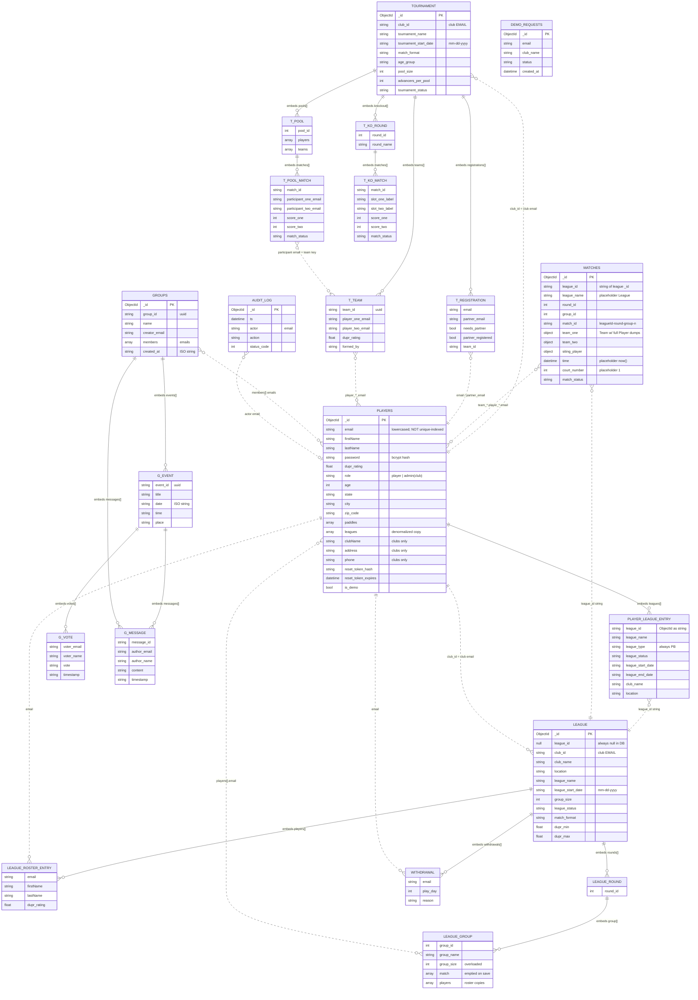

# Current schema: pickleball data layer

> Snapshot of the data model **as it exists in the code today** (branch `ybutola/fix_schema`, 2026-10-01).
> Companion doc: [proposed-schema.md](proposed-schema.md).
> Scope: the `pickleball` MongoDB database only. The RAG database `document_embeddings` is out of scope.

## 1. Engine, access layer, and sources of truth

| Aspect | What's there |
|---|---|
| Engine | MongoDB, database `pickleball`. Connection string comes from `MONGO_URI`. |
| Driver | Raw `pymongo`, no ODM/ORM. Every store class opens its **own** `MongoClient` in `__init__` (e.g. [pb_league_store.py:20-26](../../app/store/mongo/pb_league_store.py#L20-L26)), and services create new store instances inline (e.g. [pb_league_service.py:20-22](../../app/services/pb_league_service.py#L20-L22), [:138](../../app/services/pb_league_service.py#L138)). |
| Migrations | **None.** No migration framework, no migration scripts. |
| DB-side validation | **None.** No `$jsonSchema` validators on any collection. |
| Indexes | Only `audit_log` ([pb_audit_store.py:33-35](../../app/store/mongo/pb_audit_store.py#L33-L35)) and `demo_requests` ([pb_demo_request_store.py:32-33](../../app/store/mongo/pb_demo_request_store.py#L32-L33)). All other collections rely on the default `_id` index. [pb_player_store.py:77-80](../../app/store/mongo/pb_player_store.py#L77-L80) says explicitly that `players` has no index. |
| Schema truth | Pydantic models in [app/vo/pb/](../../app/vo/pb/) are the only declared schema. Stores frequently write **raw dicts** that bypass them (e.g. roster entries in [pb_league_service.py:155-160](../../app/services/pb_league_service.py#L155-L160)), so the VOs are a loose guide rather than a contract. |
| Frontend types | TypeScript interfaces in `frontend/src/app/**` (e.g. `player/player.ts`, `admin/admin.ts`, `admin/season-progress.ts`, `matches/match.ts`) mirror the API responses by hand. |
| Seed / fixture sources | [seed_demo.py](../../seed_demo.py), [seed_platform_admin.py](../../seed_platform_admin.py), [test_data_seeder.py](../../test_data_seeder.py), [test_tournament_seeder.py](../../test_tournament_seeder.py), [cleanup_admin_roster_entries.py](../../cleanup_admin_roster_entries.py). |

### Collections in use

| Collection | Store | Notes |
|---|---|---|
| `players` | [pb_player_store.py](../../app/store/mongo/pb_player_store.py) | Holds **both** player accounts and club accounts (`role: "admin"`). |
| `league` | [pb_league_store.py](../../app/store/mongo/pb_league_store.py) | A single document holds a league's roster, rounds, groups and withdrawals. |
| `matches` | [pb_match_store.py](../../app/store/mongo/pb_match_store.py) | League matches only. CLAUDE.md calls this collection `match`, which is wrong. |
| `tournament` | [pb_tournament_store.py](../../app/store/mongo/pb_tournament_store.py) | A single document holds registrations, teams, pools, the knockout bracket **and all tournament match scores**. |
| `groups` | [pb_group_store.py](../../app/store/mongo/pb_group_store.py) | Social "player groups" with embedded events, votes and messages. |
| `audit_log` | [pb_audit_store.py](../../app/store/mongo/pb_audit_store.py) | Activity feed for the platform console. |
| `demo_requests` | [pb_demo_request_store.py](../../app/store/mongo/pb_demo_request_store.py) | "Book a demo" form submissions. |

## 2. Entity-relationship diagram

Solid lines are containment (embedded arrays). Dashed lines are **soft references by email string or by id string**; MongoDB enforces none of them.

## 3. Collections

Notation: **Req** means the Pydantic model requires the field. *Nullable* means the field can be missing or `null` in stored docs. "Constraint" means app-level only; nothing is enforced in the database.

---

### 3.1 `players` ★ contains the preserved player profiles

**Purpose.** One document per login account. Player accounts and club accounts (`role: "admin"`) share this collection. The platform superadmin is **not** stored: it is granted at sign-in from the `SUPERADMIN_EMAILS` env var ([security.py `is_superadmin_email`](../../app/utils/security.py)).

**Model:** `Player` in [app/vo/pb/player.py:90-110](../../app/vo/pb/player.py#L90-L110). It is written via `model_dump(exclude={'id'})` in [pb_player_service.py:454-469](../../app/services/pb_player_service.py#L454-L469) (club) and [:520-534](../../app/services/pb_player_service.py#L520-L534) (player).

| Field | Type | Nullable | Default | Constraint / notes |
|---|---|---|---|---|
| `_id` | ObjectId | no | auto | Default index only. |
| `email` | string | no | — | Lowercased on write ([pb_player_store.py:42](../../app/store/mongo/pb_player_store.py#L42)). **No unique index.** Uniqueness is check-then-insert in the service, which can race. |
| `firstName` | string | no | — | Req, min 1 at signup. For clubs: the club name. |
| `lastName` | string | no | — | Req. For clubs: the literal `"Admin"` ([pb_player_service.py:456](../../app/services/pb_player_service.py#L456)). |
| `password` | string | no in practice | `None` in the VO | bcrypt hash (input truncated to 72 bytes). |
| `dupr_rating` | float | yes | `None` | 0.0–8.0 at signup and profile edit. Clubs are stored with `0.0`. Self-reported. |
| `role` | string | yes (legacy) | `"player"` | `"player"` or `"admin"` (club). Legacy docs without `role` count as players (`$ne: "admin"`). |
| `age` | int | yes | `None` | 13–120. Profile-edit only. |
| `state` | string | yes | `None` | Max 100. |
| `city` | string | yes | `None` | Max 100. |
| `zip_code` | string | yes | `None` | Normalized to 5 digits; must be a known ZIP ([app/utils/geo.py](../../app/utils/geo.py)). |
| `paddles` | array of `{brand: string(1–40), model?: string(≤60)}` | yes (older docs missing or `null`) | `[]` | Max 3. `null` is coerced to `[]` on read ([player.py:24-31](../../app/vo/pb/player.py#L24-L31)). |
| `leagues` | array of `PlayerLeague` | no | `[]` | **Denormalized copy of league data**, see §3.1.1. |
| `clubName` | string | yes | `None` | Clubs only. |
| `address` | string | yes | `None` | Clubs only. |
| `phone` | string | yes | `None` | Clubs only. |
| `reset_token_hash` | string | yes | — | SHA-256 of the reset token. Set by `set_reset_token` ([pb_player_store.py:203-210](../../app/store/mongo/pb_player_store.py#L203-L210)) and `$unset` on use. |
| `reset_token_expires` | datetime (naive UTC) | yes | — | `utcnow()+30min` ([pb_player_service.py:237](../../app/services/pb_player_service.py#L237)). |
| `is_demo` | bool | yes | — | Set only by `seed_demo.py` (`_mark_demo`). Not in the VO. |

**Indexes:** `_id` only. Every lookup by `email` and `reset_token_hash` is a collection scan.

**Readers / writers**
- **Write:**
  - `create_player`: signup, club signup, platform console create, public tournament registration.
  - `update_player_profile` ([pb_player_store.py:229-249](../../app/store/mongo/pb_player_store.py#L229-L249)), which **can change `email`**.
  - Password and reset-token updates.
  - `bulk_update_players_league_details` and `remove_league_from_player` (the `leagues[]` copy).
  - `delete_player_by_email` (platform console).
  - `seed_demo.py` and `cleanup_admin_roster_entries.py`.
- **Read:**
  - `find_player_by_email`: sign-in, profile, registration, club lookup at league creation ([pb_league_service.py:49](../../app/services/pb_league_service.py#L49)).
  - `get_all_players`.
  - `find_players` (search).
  - `get_paddles_by_emails` (roster side-join).
  - `get_clubs`, `count_by_role`.
  - `get_league_by_player_email`, an aggregation `$lookup` into `league` ([pb_player_store.py:251-283](../../app/store/mongo/pb_player_store.py#L251-L283)).

#### 3.1.1 Embedded `leagues[]` (`PlayerLeague`, [player.py:46-56](../../app/vo/pb/player.py#L46-L56))
`{league_id (str), league_name, league_type ("PB"), league_status, league_start_date, league_end_date, club_name, location}`. It is pushed on registration ([pb_league_service.py:164-174](../../app/services/pb_league_service.py#L164-L174)) and at league creation, and pulled on unregister. Nothing refreshes it when the league changes, and `delete_league` leaves it dangling. `rounds` is not stored; the aggregation adds it at read time.

#### 3.1.2 ★ Player profile fields that must be preserved

These are the fields on every `players` document with `role != "admin"` (club accounts are **not** preserved, by decision):

| # | Field | Why it must survive |
|---|---|---|
| 1 | `_id` | Stable identity. The redesign keys everything by it. |
| 2 | `email` | Login identifier, JWT `sub`. |
| 3 | `password` (bcrypt hash) | Losing it locks every user out. |
| 4 | `firstName` | Profile. |
| 5 | `lastName` | Profile. |
| 6 | `dupr_rating` | Self-reported skill rating, used for eligibility and seeding. |
| 7 | `age` | Profile. Drives tournament age eligibility. |
| 8 | `state` | Profile / search. |
| 9 | `city` | Profile / search. |
| 10 | `zip_code` | Distance search anchor. |
| 11 | `paddles[]` (`brand`, `model`) | Profile. |
| 12 | `reset_token_hash`, `reset_token_expires` | In-flight password resets. These can be dropped if expired. |
| 13 | `is_demo` | Marks demo-seeded accounts. |
| 14 | `role` | Always `"player"` for preserved docs. It carries no information once clubs move out. |

**Not preserved** (derived or club-only): `leagues[]`, `clubName`, `address`, `phone`.

---

### 3.2 `league`

**Purpose.** One document per league. It holds the configuration, the registered roster, all rounds/groups (with group rosters), and play-day withdrawals. It does **not** hold match results; those were split out to `matches` ([pb_league_service.py:67-82](../../app/services/pb_league_service.py#L67-L82)).

**Model:** `League` in [app/vo/pb/league.py:13-55](../../app/vo/pb/league.py#L13-L55), stored via `model_dump()` ([pb_league_store.py:34](../../app/store/mongo/pb_league_store.py#L34)).

| Field | Type | Nullable | Default | Constraint / notes |
|---|---|---|---|---|
| `_id` | ObjectId | no | auto | The real league id. The API exposes it as `league_id: str`. |
| `league_id` | null | — | `None` | **Always stored as `null`**: `model_dump()` runs before the id is assigned ([pb_league_store.py:34,47](../../app/store/mongo/pb_league_store.py#L34)). |
| `club_id` | string | yes | `None` | **The owning club's email** (set from JWT `sub`, [pb_league.py:71](../../app/api/v1/routers/pickleball/pb_league.py#L71)). |
| `club_name` | string | yes | `None` | Copied from the club account at creation ([pb_league_service.py:48-52](../../app/services/pb_league_service.py#L48-L52)). |
| `location` | string | yes | `None` | Copied from `club.address` at creation. |
| `league_name` | string | no | — | Req, min 3. Not unique, but `GET /league/name/{name}` does `find_one` by name. |
| `league_description` | string | yes | `None` | |
| `league_start_date` | string | no | — | Req, regex `mm-dd-yyyy`. |
| `league_end_date` | string | yes | `None` | Free string. |
| `league_duration` | string | yes | `None` | Free string. Unused by logic. |
| `group_size` | int | no | — | Req, > 0. Players per group (default 4 when read). |
| `league_status` | string | yes | `None` | Free string. Values seen: `active`, `Active`, `pending`. Legacy docs use `status` instead, and both are read ([pb_league_store.py:85,95](../../app/store/mongo/pb_league_store.py#L85)). |
| `match_format` | string | no | — | Req, min 1. Free string. Logic always assumes rotating doubles. |
| `dupr_min` / `dupr_max` | float | yes | `None` | 0–8, max ≥ min. Enforced at registration ([pb_league_service.py:669-683](../../app/services/pb_league_service.py#L669-L683)). |
| `players` | array of roster entries | no | `[]` | `{firstName, lastName, email, dupr_rating}` **copied at registration** ([pb_league_service.py:155-161](../../app/services/pb_league_service.py#L155-L161)). Dedup is `$addToSet` on the whole subdoc. |
| `rounds` | array of `Round` | no | `[]` | See below. |
| `withdrawals` | array of `{email, play_day, reason}` | no | `[]` | Appended per play day ([pb_league_store.py:283-289](../../app/store/mongo/pb_league_store.py#L283-L289)). Nothing prevents duplicates. |

**Embedded `rounds[]`** (`Round`, [round.py](../../app/vo/pb/round.py)): `{round_id: int, group: [Group]}`. Rounds are numbered 1..N. The service derives `play_day = (round_id + 1) // 2`.

**Embedded `rounds[].group[]`** (`Group`, [group.py](../../app/vo/pb/group.py)):

| Field | Type | Notes |
|---|---|---|
| `group_id` | int | 1 = top of the ladder. |
| `group_name` | string | `"Group N"`. |
| `group_size` | int? | **Overloaded**: written as the *number of matches* ([pb_league_store.py:263](../../app/store/mongo/pb_league_store.py#L263), [pb_league_service.py:72](../../app/services/pb_league_service.py#L72)), but read as the *player target size* ([pb_league_service.py:443](../../app/services/pb_league_service.py#L443), [:545](../../app/services/pb_league_service.py#L545)) and as a completeness check ([:230-234](../../app/services/pb_league_service.py#L230-L234)). |
| `match` | array of `Match` | Emptied before saving when the admin posts rounds. Populated by auto-slot (`set_group_matches`). The same matches are therefore stored twice. |
| `players` | array of roster copies | Order is meaningful: it is the ladder seed (promoted players appended, relegated players prepended, [pb_league_service.py:355-376](../../app/services/pb_league_service.py#L355-L376)). |

**Indexes:** `_id` only. Queried by `_id`, `club_id`, `league_name`, `league_status`/`status`, `players.email`, `rounds.group.players.email`.

**Readers / writers:** [pb_league_store.py](../../app/store/mongo/pb_league_store.py), which is entirely whole-array read-modify-write of `rounds` (`add_players_to_round_group`, `update_round_group_players`, `remove_player_from_play_day`, `set_group_matches`, `purge_player`). Also [pb_player_store.py:251-283](../../app/store/mongo/pb_player_store.py#L251-L283) (`$lookup`) and `cleanup_admin_roster_entries.py`.

---

### 3.3 `matches`

**Purpose.** League match results, one document per match. Tournament matches live inside `tournament`, not here.

**Model:** `Match` ([match.py](../../app/vo/pb/match.py)) with two `Team`s ([team.py](../../app/vo/pb/team.py)), upserted by `(league_id, round_id, group_id, match_id)` ([pb_match_store.py:28-48](../../app/store/mongo/pb_match_store.py#L28-L48)).

| Field | Type | Nullable | Default | Notes |
|---|---|---|---|---|
| `_id` | ObjectId | no | auto | |
| `league_id` | string | no | — | String form of `league._id`. |
| `league_name` | string | no | — | Hard-coded to `"League"` by auto-slot ([pb_league_service.py:605,648](../../app/services/pb_league_service.py#L605)). |
| `round_id` | int | no | — | Legacy docs may hold strings; the code coerces ([pb_league_service.py:128-133](../../app/services/pb_league_service.py#L128-L133)). |
| `group_id` | int | no | — | |
| `match_id` | string | no | — | `"{league_id}-{round}-{group}-{n}"` for auto-slotted matches. Admin-posted ids come from the client. |
| `team_one`, `team_two` | `Team` | no | — | `{team_id, team_name ("Team 1"/"Team 2"), player_one: Player, player_two: Player, score: int}`. **Each player is a full `Player` dump**, including keys `password: null`, `role`, `leagues: []`, `paddles: []`. |
| `siting_player` | `Player` | yes | `None` | The 5th player who sits out (5-player groups). Misspelled field name. |
| `time` | datetime | no | — | Placeholder `datetime.now()` ([pb_league_service.py:612](../../app/services/pb_league_service.py#L612)). |
| `court_number` | int | no | — | Placeholder `1`. |
| `match_status` | string | no | `"YetToPlay"` | Values seen: `YetToPlay`, `completed`, `Completed`. |

**Score model:** one `int` per team; a match is a single game. Scores are written by `save_match_score` ([pb_match_store.py:50-78](../../app/store/mongo/pb_match_store.py#L50-L78)), which swaps sides when the payload's team names don't line up.

**Indexes:** `_id` only. Queries:
- by `(league_id)`
- by `(league_id, match_id)`
- by `(league_id, round_id, group_id)`
- a 4-way `$or` over `team_*.player_*.email` (player history, [pb_match_store.py:84-95](../../app/store/mongo/pb_match_store.py#L84-L95))

---

### 3.4 `tournament`

**Purpose.** One document per tournament, holding everything: config, registrations, flat roster, teams, pools with their round-robin matches, and the knockout bracket with its matches and scores.

**Model:** `Tournament` ([tournament.py:96-201](../../app/vo/pb/tournament.py#L96-L201)), inserted with `model_dump(exclude={"tournament_id"})` ([pb_tournament_store.py:31](../../app/store/mongo/pb_tournament_store.py#L31)) and then mutated via `$set` of whole sub-arrays.

| Field | Type | Nullable | Default | Constraint / notes |
|---|---|---|---|---|
| `_id` | ObjectId | no | auto | Exposed as `tournament_id`. |
| `club_id` | string | yes | `None` | Club **email**. |
| `club_name`, `location` | string | yes | `None` | Copied from the club. |
| `tournament_name` | string | no | — | Min 3. |
| `tournament_description` | string | yes | `None` | |
| `tournament_start_date` | string | no | — | `mm-dd-yyyy`. |
| `tournament_end_date` | string | yes | `None` | Free string. |
| `match_format` | enum string | no | `"doubles"` | `singles` / `doubles` / `mixed-doubles`. |
| `dupr_min` / `dupr_max` | float | yes | `None` | 0–8. |
| `age_group` | enum string | no | `"open"` | `open, 19+, 35+, 50+, 60+, 70+, custom`. |
| `age_min` / `age_max` | int | yes | `None` | Derived for presets, explicit for `custom` ([tournament.py:159-183](../../app/vo/pb/tournament.py#L159-L183)). |
| `pool_size` | int | no | 4 | > 1. |
| `advancers_per_pool` | int | no | 2 | > 0. |
| `tournament_status` | string | yes | `"pending"` | Values seen: `pending`, `active`, `completed`. |
| `players` | array of `{firstName,lastName,email,dupr_rating}` | no | `[]` | **Derived** from `registrations` by `_roster` ([pb_tournament_service.py:572-591](../../app/services/pb_tournament_service.py#L572-L591)) and stored anyway. Includes invited partners who may have no account. |
| `registrations` | array of `TournamentRegistration` | no | `[]` | `{firstName,lastName,email,dupr_rating, needs_partner, partner_email, partner_name, partner_dupr, partner_registered, team_id}` ([tournament.py:23-44](../../app/vo/pb/tournament.py#L23-L44)). Partner name and DUPR are copies. |
| `teams` | array of `TournamentTeam` | no | `[]` | `{team_id (uuid), team_name, player_one_email/name, player_two_email/name, dupr_rating (avg), formed_by}` ([tournament_team.py](../../app/vo/pb/tournament_team.py)). |
| `pools` | array of `Pool` | no | `[]` | `{pool_id, pool_name, players[] (singles) or teams[] (doubles), matches[PoolMatch]}`. |
| `pools[].matches[]` | `PoolMatch` | — | — | `{match_id, pool_id, participant_one/two_email, participant_one/two_name, score_one, score_two, match_status}`. For doubles the "participant email" is player one's email, standing in for the team. |
| `knockout` | array of `KnockoutRound` | no | `[]` | `{round_id, round_name, matches[KnockoutMatch]}`. A match is `{match_id, slot_one_label, slot_two_label, participant_*, score_one, score_two, match_status}`. Byes are auto-completed 1–0 with status `Bye` ([tournament_bracket.py:292-301](../../app/services/tournament_bracket.py#L292-L301)). |

**Indexes:** `_id` only. Queried by `_id`, `club_id`, `players.email`, `registrations.email`.

**Readers / writers:** [pb_tournament_store.py](../../app/store/mongo/pb_tournament_store.py), [pb_tournament_service.py](../../app/services/pb_tournament_service.py) (register, draw, score, reopen), and [tournament_bracket.py](../../app/services/tournament_bracket.py) (pool seeding, standings, knockout advancement).

---

### 3.5 `groups` (social player groups)

**Purpose.** Ad-hoc player groups with events (RSVP-style votes) and discussion threads.

**Models:** request/response VOs in [group_ext.py](../../app/vo/pb/group_ext.py). Documents are built as raw dicts in [pb_group_store.py](../../app/store/mongo/pb_group_store.py).

| Field | Type | Notes |
|---|---|---|
| `_id` | ObjectId | Not used as the id. |
| `group_id` | string (uuid4) | The id the API uses. **Not indexed**, not unique. |
| `name` | string | min 1 |
| `description` | string? | |
| `creator_email` | string | Lowercased. **Taken from the request body**, not the token. |
| `members` | string[] | Emails (`$addToSet`). |
| `events[]` | `{event_id, title, date (ISO string), time?, place?, notes?, votes[], messages[]}` | |
| `events[].votes[]` | `{voter_email, voter_name, vote, timestamp (ISO string)}` | `vote` is one of `In`, `In but late`, `In but leave early`, `May be`, `Out`. One per voter via pull-then-push (two non-atomic writes, [pb_group_store.py:118-127](../../app/store/mongo/pb_group_store.py#L118-L127)). |
| `messages[]`, `events[].messages[]` | `{message_id, author_email, author_name, content, timestamp}` | **Unbounded arrays** inside one document. |
| `created_at` | string (ISO) | |

**Indexes:** `_id` only. Queried by `group_id` and `members`.

---

### 3.6 `audit_log`

**Purpose.** One document per mutating `/api/v1` request and per sign-in, written by `AuditLogMiddleware` and `PBPlayerService._audit_signin`.

**Fields** (`AuditEntry`, [audit.py](../../app/vo/pb/audit.py)): `ts` (datetime, UTC), `actor` (email or `"anonymous"`), `actor_role?`, `method`, `path`, `route?`, `status_code`, `duration_ms`, `action`, `client_ip?`, `error?`.

**Indexes:** `{ts:-1}`, `{actor:1, ts:-1}`, `{action:1, ts:-1}`, created lazily ([pb_audit_store.py:29-39](../../app/store/mongo/pb_audit_store.py#L29-L39)). No TTL, so the collection grows forever.

### 3.7 `demo_requests`

**Purpose.** Public "Book a demo" form submissions.

**Fields** ([pb_demo_request_service.py:20-31](../../app/services/pb_demo_request_service.py#L20-L31)): `name`, `email` (lowercased), `club_name`, `phone?`, `club_size?`, `preferred_time?`, `message?`, `client_ip?`, `status` (`"new"`), `created_at` (datetime).

**Indexes:** `{created_at:-1}`, `{email:1, created_at:-1}`.

---

## 4. How the app actually uses the data

| Use case | Path | Data touched |
|---|---|---|
| Sign up / sign in | `pb_authorization.py` → `PBPlayerService` | `players` (find by email: collection scan) |
| Club creates a league | `POST /league` | Reads the club from `players`, inserts into `league`, pushes `players.leagues[]` (empty roster at creation) |
| Player registers | `POST /league/register` | Reads `players`, `$addToSet` into `league.players`, pushes into `players.leagues` |
| Admin slots a play day | `POST /league/{id}/day/{d}/slot` | Read-modify-write of the whole `league.rounds`, upserts into `matches` |
| Admin posts rounds | `POST /league/round` | Strips matches out of the payload, replaces rounds wholesale, upserts matches |
| Score a match | `POST /league/match/score` | Updates `matches`. If completed, computes standings in Python, then promotion/relegation writes the next round into `league.rounds` and may auto-slot |
| League page | `GET /league/name/{name}` | `league` by **name** + all `matches` for the league + paddles side-join from `players` |
| Player dashboard | `GET /player/league/{email}` | `$lookup` from `players.leagues[]` into `league` |
| Match history | `GET /player/{email}/matches` | `matches` 4-way email `$or` + full scans of every tournament containing the player |
| Stats page | frontend `stats/stats.ts` | Win/loss and partner stats **computed in the browser** from match history |
| Tournament flows | `pb_tournament.py` | Whole-array `$set` on `tournament` |
| Platform console | `pb_admin.py` | `players`, counts over `league`/`tournament`, `audit_log` |

**Data the app uses that isn't modeled**
- **Standings / win-loss records** are derived in three places: `calculate_group_standings` ([pb_league_service.py:241-301](../../app/services/pb_league_service.py#L241-L301)), `pool_standings` ([tournament_bracket.py:216](../../app/services/tournament_bracket.py#L216)), and the frontend (`frontend/src/app/stats/stats.ts`, `league/dashboard.ts:131-132`).
- **Play day** is not stored anywhere; it is computed as `(round_id + 1) // 2`. There is no calendar date per play day.
- **League ladder position** is implicit in the order of `group.players[]`.
- **Paddles on rosters** are joined at read time (`paddles_by_email`, [pb_league_service.py:99-104](../../app/services/pb_league_service.py#L99-L104)).

**Defined but unused**
- `league.league_duration`, `league.match_format` (no branching on it), `league.league_id` (always null), `Team.team_id`/`team_name` (constant `team_1_N`/`"Team 1"`), `Match.time` and `court_number` (placeholders).
- `PBMongoDBStore` ([pb_mongo_db_store.py](../../app/store/mongo/pb_mongo_db_store.py)) is a dead duplicate store. It is referenced only by `verify_*.py`, and it queries fields (`league_id`, `status`) that real documents don't use. Its `store_new_league_details` reads `league_details.status`, which doesn't exist on `League`.
- `PBPlayerService.update_player_league` ([pb_player_service.py:689-691](../../app/services/pb_player_service.py#L689-L691)) calls `update_player_league_details`, which exists only on the dead store, so it raises `AttributeError` if ever called.
- `GET /players/{league_id}` ([pb_player.py:67-84](../../app/api/v1/routers/pickleball/pb_player.py#L67-L84)) calls `get_player_by_league_id`, which doesn't exist on the service, so it always returns 500.
- Stub methods `get_league_details`, `get_match_details`, … return fixed strings ([pb_league_service.py:24-43](../../app/services/pb_league_service.py#L24-L43)).

## 5. Discrepancies between sources

| # | Discrepancy | Where |
|---|---|---|
| 1 | CLAUDE.md says the match collection is `match`; the code uses `matches`. | [pb_match_store.py:25](../../app/store/mongo/pb_match_store.py#L25) |
| 2 | `League.league_id` is in the model and stored as `null`; the real id is `_id`. The dead store queries `league_id`. | [pb_league_store.py:34,47](../../app/store/mongo/pb_league_store.py#L34), [pb_mongo_db_store.py:122](../../app/store/mongo/pb_mongo_db_store.py#L122) |
| 3 | League status is read from `league_status` **or** legacy `status`. | [pb_league_store.py:85,95](../../app/store/mongo/pb_league_store.py#L85) |
| 4 | `Group.group_size` means "players" in one place and "matches" in another. | §3.2 |
| 5 | `CLAUDE.md` describes the `role` values, but club accounts are also forced into player-shaped fields (`firstName`=club name, `lastName="Admin"`, `dupr_rating=0.0`). | [pb_player_service.py:454-465](../../app/services/pb_player_service.py#L454-L465) |
| 6 | Status casing: `completed` (league service) vs `Completed` (tournament); `Active` vs `active`. | [pb_league_service.py:125](../../app/services/pb_league_service.py#L125), [tournament_bracket.py](../../app/services/tournament_bracket.py), frontend |
| 7 | Date types: `mm-dd-yyyy` strings (league/tournament), ISO strings (groups), BSON datetimes (audit, reset tokens, demo requests), naive `utcnow()` (reset). | §3 |
| 8 | `Player` VO lists `role` as "player or admin"; superadmin exists only in tokens. | [player.py:98](../../app/vo/pb/player.py#L98) |
| 9 | `ProfileResponse` / `PlayerSearchResult` expose `email`, while `PlayerSearchResult`'s docstring claims to minimize location exposure. Email is still exposed to every searcher. | [player.py:153-172](../../app/vo/pb/player.py#L153-L172) |
| 10 | `TournamentTeam` vs `Team`: two different "team" models with different shapes (email strings vs embedded `Player`). | [tournament_team.py](../../app/vo/pb/tournament_team.py), [team.py](../../app/vo/pb/team.py) |
