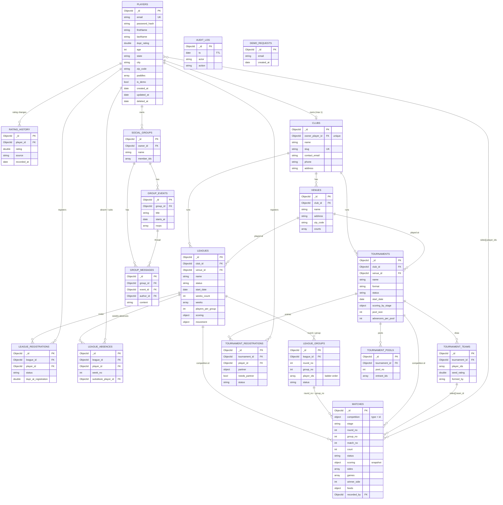

# Proposed schema: pickleball data layer redesign

> Status: **proposal for review**. Nothing here has been implemented, and no data has been migrated.
> Baseline: [current-schema.md](current-schema.md). File references are relative to the repo root as of 2026-10-01.

**Ground rules this design follows**
- **Engine stays MongoDB.** The redesign normalizes into purpose-built collections, adds `$jsonSchema` validators and real unique/compound indexes, and uses a single shared `MongoClient`.
- **Only player profiles are preserved.** These are `players` documents with `role != "admin"`. Everything else is dropped and recreated: leagues, matches, tournaments, social groups, and club accounts.
- **Every reference is by `ObjectId`**, never by email.
- **Pragmatic for a small league app.** There are no seasons, no multi-staff clubs, no event sourcing, and no score-confirmation workflow.

---

## 0. Business rules this schema encodes

These were confirmed by the product owner and become the documented defaults.

| Area | Rule |
|---|---|
| League shape | A league is a **ladder league over N weeks**. The club sets `weeks_count`, typically 8 or 10. A league *is* the season; there is no separate season entity. |
| League week | Each week is one play day with **2 rounds**. |
| League groups | Players are split into groups of **4 or 5**. After each round, the top player moves up a group and the bottom player moves down. |
| League scoring | One game to **11, win by 1**. |
| Tournament scoring | Defaults per stage, **all customizable at tournament creation**: pool → one game to 16, win by 1; quarterfinal → one game to 16, win by 1; semifinal → best of 3, games to 11, win by 1; final → best of 3, games to 11, win by 1. |
| Forfeits / no-shows | Supported. A forfeit is **not** scored as 11–0: it counts as a win/loss only and adds **no points** to point differential or points won. |
| Substitutes | Supported. A sub's result does **not** move the absent player: the absent player stays in the same group for the next round. |
| Who records scores | Match participants **and** the club owner. |
| DUPR | **Self-reported.** There is no DUPR ID and no verification. |
| Email privacy | **Players never see other players' emails.** |
| Clubs | **One owner per club, one club per person.** There is no multi-staff model. |
| Tournaments | In scope at the same depth as leagues. |

---

## 1. Findings

Severity:
- **Critical**: causes wrong data, data loss, or a security hole today.
- **Important**: causes drift, races, or blocks required features.
- **Nice-to-have**: hygiene.

### 1.1 Critical

| # | Finding | Evidence | Consequence |
|---|---|---|---|
| C1 | **Player identity is the email string everywhere, and email is editable.** `update_profile` rewrites `players.email` only. | Email change: [pb_player_service.py:415-433](../../app/services/pb_player_service.py#L415-L433). References by email: `league.players[]`, `league.rounds[].group[].players[]`, `league.withdrawals[]`, every `matches.team_*.player_*`, `tournament.players/registrations/teams/pools/knockout`, `groups.members/votes/messages`. | After an email change the player vanishes from their leagues, match history, standings, tournaments and groups, and withdrawals no longer match. Nothing can repair it. |
| C2 | **No unique index on `players.email`.** Uniqueness is check-then-insert. | [pb_player_service.py:505-510](../../app/services/pb_player_service.py#L505-L510), [pb_player_store.py:77-80](../../app/store/mongo/pb_player_store.py#L77-L80) | Double-submits or parallel signups create duplicate accounts, and `find_one` then returns an arbitrary one. Every email lookup (sign-in, every registration) is a collection scan. |
| C3 | **Admin mutations never check club ownership.** `get_current_admin` checks only `role == "admin"`. | [pb_league.py:77-84](../../app/api/v1/routers/pickleball/pb_league.py#L77-L84) (`/league/round`), [:129-140](../../app/api/v1/routers/pickleball/pb_league.py#L129-L140) (slot), [:159-170](../../app/api/v1/routers/pickleball/pb_league.py#L159-L170) (delete); tournament draw/score/reopen/delete in [pb_tournament.py:116-200](../../app/api/v1/routers/pickleball/pb_tournament.py#L116-L200) | Any club can rewrite, re-slot, score or delete any other club's league or tournament. |
| C4 | **Social groups API has no authentication at all**, and identity comes from the request body. | [pb_group.py:74-230](../../app/api/v1/routers/pickleball/pb_group.py#L74-L230): no `Depends(get_current_*)`; `creator_email`, `voter_email`, `author_email` are client-supplied | Anyone on the internet can create groups, add members, vote and post as any user, and read any group, including member emails. |
| C5 | **Player PII is exposed on unauthenticated endpoints.** | `GET /players` returns every player's email + leagues ([pb_player.py:18-32](../../app/api/v1/routers/pickleball/pb_player.py#L18-L32)). `GET /league/name/{name}` and `/league/id/{id}` return full rosters with emails and DUPR ([pb_league.py:44-55](../../app/api/v1/routers/pickleball/pb_league.py#L44-L55)). `/player/league/{email}` and `/player/{email}/matches` are keyed by email with no auth ([pb_player.py:86-89](../../app/api/v1/routers/pickleball/pb_player.py#L86-L89), [pb_league.py:57-61](../../app/api/v1/routers/pickleball/pb_league.py#L57-L61)). `/players/search` returns `email` to every signed-in user ([player.py:163](../../app/vo/pb/player.py#L163)). | This violates the "players never see each other's emails" rule and enables email harvesting. |
| C6 | **Identity spoofing on writes.** League registration takes `email` from the body, not the token. Any signed-in user can score **any** league match. | [pb_league.py:94-104](../../app/api/v1/routers/pickleball/pb_league.py#L94-L104), [:86-91](../../app/api/v1/routers/pickleball/pb_league.py#L86-L91) | A player can register others into leagues and change the results of matches they're not in. |
| C7 | **`group_size` is overloaded** between "players in group" and "matches in group". | Written as match count: [pb_league_store.py:263](../../app/store/mongo/pb_league_store.py#L263), [pb_league_service.py:72](../../app/services/pb_league_service.py#L72). Read as player target: [:443](../../app/services/pb_league_service.py#L443), [:545](../../app/services/pb_league_service.py#L545). Read as completeness check: [:230-234](../../app/services/pb_league_service.py#L230-L234). | A 4-player group gets `group_size=3` after slotting. Auto-slot then thinks 3 players are enough. Promotion and relegation are gated on a value that changes meaning depending on which path last wrote it. |
| C8 | **Password-reset links are logged in plaintext.** | [pb_player_service.py:241-243](../../app/services/pb_player_service.py#L241-L243) | Anyone with log access (Cloud Logging) can take over any account that requests a reset. |

### 1.2 Important

| # | Finding | Evidence | Fix in proposal |
|---|---|---|---|
| I1 | **Whole-array read-modify-write on `league.rounds`.** Concurrent score submissions in different groups each read the league, edit their group, and `$set` the entire `rounds` array, so the last writer wins and silently undoes the other's promotion or relegation. | [pb_league_store.py:140-272](../../app/store/mongo/pb_league_store.py#L140-L272), `purge_player` [:321-333](../../app/store/mongo/pb_league_store.py#L321-L333) | `league_groups`: one document per (round, group), atomic per-doc updates. |
| I2 | **Same race on tournaments**: registrations, teams, pools and bracket are `$set` wholesale. | [pb_tournament_service.py:455-464](../../app/services/pb_tournament_service.py#L455-L464), [:540](../../app/services/pb_tournament_service.py#L540), [:593-600](../../app/services/pb_tournament_service.py#L593-L600) | `tournament_registrations`, `tournament_teams`, `tournament_pools`; matches in `matches`. |
| I3 | **`players.leagues[]` is a stale denormalized copy.** It is never refreshed when a league changes, and `delete_league` leaves it dangling. | Writes: [pb_league_service.py:164-174](../../app/services/pb_league_service.py#L164-L174), [pb_player_store.py:162-183](../../app/store/mongo/pb_player_store.py#L162-L183). Delete: [pb_league_service.py:661-666](../../app/services/pb_league_service.py#L661-L666) | Dropped. Replaced by `league_registrations`. |
| I4 | **Frozen roster copies** (`{name, email, dupr}`) and **full `Player` dumps inside matches**, including `password: null`, `role`, `leagues`, `paddles`. | [pb_league_service.py:155-161](../../app/services/pb_league_service.py#L155-L161), [team.py](../../app/vo/pb/team.py), [pb_league_service.py:588-601](../../app/services/pb_league_service.py#L588-L601) | Store `player_id` only, and join names at read time with one `$in` query. |
| I5 | **Matches are stored twice** (`league.rounds[].group[].match[]` *and* `matches`), and auto-slot checks both to decide whether a group is slotted. | [pb_league_service.py:457-469](../../app/services/pb_league_service.py#L457-L469) | `matches` is the single source. |
| I6 | **The scoring model can't express the rules.** It stores one int per side: no games, no best-of-3, no win-by margin, no forfeit. Tournament knockout byes are faked as a 1–0 score. | [match.py](../../app/vo/pb/match.py), [tournament.py:47-87](../../app/vo/pb/tournament.py#L47-L87), [tournament_bracket.py:292-301](../../app/services/tournament_bracket.py#L292-L301) | `games[]` + a `scoring` rule snapshot + `status: forfeit/bye`. |
| I7 | **Strings for dates and enums.** `mm-dd-yyyy` strings can't be sorted or range-queried. Status values have mixed case (`completed`/`Completed`, `Active`/`active`), and both `status` and `league_status` exist. | [league.py:27](../../app/vo/pb/league.py#L27), [tournament.py:111-115](../../app/vo/pb/tournament.py#L111-L115), [pb_league_store.py:85,95](../../app/store/mongo/pb_league_store.py#L85) | BSON `date`, lowercase enums enforced by validators. |
| I8 | **No indexes for actual query patterns.** League by `club_id` / `league_name`; matches by `(league_id, round_id, group_id)` and a 4-way email `$or`; tournaments by `players.email`; groups by `group_id` / `members`. All are collection scans. | §3 of current-schema | Index list per collection below. |
| I9 | **League lookup by name.** `GET /league/name/{name}` is the main league-page endpoint, but names aren't unique, so it returns whichever league `find_one` hits first. | [pb_league_store.py:127-129](../../app/store/mongo/pb_league_store.py#L127-L129) | Leagues fetched by `_id` only. |
| I10 | **Standings are computed in three places** with different rules: league Python, tournament pools, browser stats. | [pb_league_service.py:241-301](../../app/services/pb_league_service.py#L241-L301), [tournament_bracket.py:216](../../app/services/tournament_bracket.py#L216), `frontend/src/app/stats/stats.ts` | One backend standings function, exposed via the API. Standings stay **derived**, never stored. |
| I11 | **Domain gaps.** The data model has no venues or courts and no date per play day. `time` and `court_number` are placeholders. There are no substitutes and no rating history. | [pb_league_service.py:605,612-613](../../app/services/pb_league_service.py#L605) | `venues.courts`, `leagues.weeks[]`, `league_absences.substitute_player_id`, `rating_history`. |
| I12 | **Clubs are fake player rows**: `firstName` = club name, `lastName = "Admin"`, `dupr_rating = 0.0`. Every player query needs `role != "admin"` to exclude them, and a superadmin script exists just to clean clubs out of rosters. | [pb_player_service.py:454-465](../../app/services/pb_player_service.py#L454-L465), [pb_player_store.py:48-59](../../app/store/mongo/pb_player_store.py#L48-L59), [cleanup_admin_roster_entries.py](../../cleanup_admin_roster_entries.py) | A real `clubs` collection, owned by one player account. |
| I13 | **Deleting a player leaves references behind.** It purges rosters but leaves match history, tournament teams, pools and groups pointing at the deleted email. Deleting a club orphans its leagues. | [pb_platform_service.py:58-100](../../app/services/pb_platform_service.py#L58-L100), [pb_tournament_store.py:116-131](../../app/store/mongo/pb_tournament_store.py#L116-L131) | Soft delete (`deleted_at`) for players; names render as "Former player". |
| I14 | **Unbounded arrays in one document**: group and event `messages[]`. | [pb_group_store.py:134-166](../../app/store/mongo/pb_group_store.py#L134-L166) | `group_messages` collection. |
| I15 | **No timestamps** on leagues, matches, tournaments or registrations, and no record of who entered a score. | — | `created_at`/`updated_at` everywhere, plus `recorded_by` and score `history[]` on matches. |

### 1.3 Nice-to-have

| # | Finding | Evidence |
|---|---|---|
| N1 | Dead or broken code against the data layer: `PBMongoDBStore`; `update_player_league` → missing method; `GET /players/{league_id}` → missing service method (always 500); stub methods returning fixed strings. | [pb_mongo_db_store.py](../../app/store/mongo/pb_mongo_db_store.py), [pb_player_service.py:689-691](../../app/services/pb_player_service.py#L689-L691), [pb_player.py:67-84](../../app/api/v1/routers/pickleball/pb_player.py#L67-L84), [pb_league_service.py:24-43](../../app/services/pb_league_service.py#L24-L43) |
| N2 | A new `MongoClient` per store instance, and stores are constructed per request and inside services. This wastes connection pools. | e.g. [pb_league_service.py:20-22](../../app/services/pb_league_service.py#L20-L22) |
| N3 | Mixed naming (`firstName` camelCase vs `dupr_rating` snake_case; misspelled `siting_player`). Collection names are mixed singular/plural (`league`, `tournament` vs `matches`, `players`). | [player.py](../../app/vo/pb/player.py), [match.py:17](../../app/vo/pb/match.py#L17) |
| N4 | `audit_log` has no TTL and grows without bound. | [pb_audit_store.py:29-39](../../app/store/mongo/pb_audit_store.py#L29-L39) |
| N5 | `reset_token_expires` is a naive `datetime.utcnow()`. | [pb_player_service.py:237](../../app/services/pb_player_service.py#L237) |
| N6 | CLAUDE.md names the match collection `match`; it's `matches`. | [pb_match_store.py:25](../../app/store/mongo/pb_match_store.py#L25) |
| N7 | Group-event votes are pull-then-push (two writes), so a crash between them loses the vote. | [pb_group_store.py:118-127](../../app/store/mongo/pb_group_store.py#L118-L127) |

**Naming decision for the redesign.** Collections are plural `snake_case`. **New** fields are `snake_case`. On `players`, the existing `firstName`/`lastName` names are **kept**: they're preserved data, and renaming them would touch nearly every frontend file for no functional gain. This is flagged as a possible follow-up, not part of this change.

---

## 2. Proposed schema

### 2.1 Entity-relationship diagram



### 2.2 Conventions (all collections)

- Every collection gets a `$jsonSchema` validator: `validationLevel: "strict"`, `validationAction: "error"`. `players` starts at `moderate` during migration (§3).
- `created_at` / `updated_at`: BSON `date`, UTC. They are set by the store layer, never by the client.
- Enum values are lowercase `snake_case` and listed in the validator.
- Calendar dates (`start_date`, week dates) are BSON `date` at 00:00 UTC. The API accepts and returns ISO `YYYY-MM-DD`. The current `mm-dd-yyyy` input format is dropped.
- **API exposure rule.** Responses about *other* players carry `{player_id, firstName, lastName, dupr_rating, city, state, paddles}`, **never `email`**. A player sees their own email. A club owner sees the emails of players registered in **their own** leagues and tournaments (see Q7).
- One shared `MongoClient`, created in `app/store/mongo/client.py`. `ensure_schema()` there creates validators and indexes idempotently.

### 2.3 Collection definitions

#### `players` ★ preserved

| Field | BSON type | Req | Notes |
|---|---|---|---|
| `_id` | objectId | ✓ | **Kept from today.** It is the identity everything else references. |
| `email` | string | ✓ | Lowercased and trimmed. **Unique index.** Login only; never exposed to other players. |
| `password_hash` | string | ✓ | Renamed from `password` (bcrypt, unchanged value). |
| `firstName`, `lastName` | string (1–100) | ✓ | Names kept for compatibility. |
| `dupr_rating` | double (0–8) \| null | | Current self-reported rating. Every change also appends to `rating_history`. |
| `age` | int (13–120) \| null | | |
| `state`, `city` | string (≤100) \| null | | |
| `zip_code` | string `^\d{5}$` \| null | | |
| `paddles` | array (≤3) of `{brand: string 1–40, model: string ≤60 \| null}` | ✓ | `[]` when none. |
| `reset_token_hash` | string \| null | | |
| `reset_token_expires` | date \| null | | Timezone-aware UTC going forward. |
| `is_demo` | bool | | Defaults to false. |
| `created_at`, `updated_at` | date | ✓ | |
| `deleted_at` | date \| null | | Soft delete. A deleted player keeps their match history (rendered as "Former player"); `email` is rewritten to `deleted+<_id>@invalid` so it can be re-registered. |
| `schema_version` | int | ✓ | `2`. |

**Removed:** `role` (clubs are their own collection; superadmin stays env-based), `leagues[]` (derived from `league_registrations`), `clubName`/`address`/`phone`.

**Indexes**
- `{email: 1}` unique
- `{reset_token_hash: 1}` sparse
- `{lastName: 1, firstName: 1}` for search; name search stays a regex, but this serves sorting and prefix matches
- `{dupr_rating: 1}`

*Rationale:* the unique email index fixes C2. Keying by `_id` fixes C1, so changing an email becomes a single-field update.

#### `rating_history`
`{_id, player_id: objectId ✓, rating: double 0–8 ✓, source: enum[self, admin, migrated] ✓, recorded_at: date ✓}`

- Index: `{player_id: 1, recorded_at: -1}`.
- *Rationale:* DUPR is self-reported and changes over time. Keeping the history lets a club see what a player claimed when they registered versus now, and it is cheap.

#### `clubs`

| Field | Type | Req | Notes |
|---|---|---|---|
| `owner_player_id` | objectId | ✓ | **Unique**: one club per person, one owner per club. |
| `name` | string 2–120 | ✓ | |
| `slug` | string `^[a-z0-9-]+$` | ✓ | Unique. Used in public URLs and share links. |
| `contact_email`, `phone`, `address` | string \| null | | Public contact details for the club, not the owner's login. |
| `created_at`, `updated_at`, `deleted_at` | date | | |

Indexes: `{owner_player_id: 1}` unique, `{slug: 1}` unique.

**Auth change.** A club owner signs in with their normal `players` account. At sign-in the token gets `role: "admin"` and `club_id` if the account owns a club; otherwise it gets `role: "player"`. The frontend keeps branching on `role`. Every admin mutation checks `resource.club_id == token.club_id` in one helper, e.g. `require_club_owner(resource)` in [app/api/v1/deps.py](../../app/api/v1/deps.py) (fixes C3).

*Rationale:* this ends the "club as a fake player row" hack (I12), lets a club owner also play (Q8), and makes ownership checkable.

#### `venues`
`{_id, club_id ✓, name ✓, address, zip_code, courts: [{number: int ✓, label: string|null}], created_at, updated_at}`

- Index: `{club_id: 1}`.
- *Rationale:* gives `matches.court` and the league location a real home instead of a copied string. A club with a single venue just has one row.

#### `leagues`

| Field | Type | Req | Notes |
|---|---|---|---|
| `club_id` | objectId | ✓ | |
| `venue_id` | objectId \| null | | |
| `name` | string 3–120 | ✓ | Unique per club: `{club_id, name}`. |
| `description` | string \| null | | |
| `format` | enum[`rotating_doubles`] | ✓ | The only format today. The enum leaves room to grow. |
| `status` | enum[`draft`, `registration_open`, `in_progress`, `completed`, `cancelled`] | ✓ | |
| `start_date` | date | ✓ | |
| `weeks_count` | int 1–52 | ✓ | Set by the club. The UI defaults to 8 and offers 8 or 10. |
| `rounds_per_week` | int, const 2 | ✓ | Stored explicitly so the round↔week mapping isn't magic: `week_no = ceil(round_no / rounds_per_week)`. |
| `weeks` | array of `{week_no: int ✓, date: date ✓, status: enum[scheduled, played, cancelled]}` | ✓ | Generated weekly from `start_date` at creation. Editable for rainouts and reschedules. `end_date` is derived from it (the last week's date), not stored. |
| `players_per_group` | enum int [4, 5] | ✓ | Target size for the week-1 split. |
| `dupr_min`, `dupr_max` | double 0–8 \| null | | Validator: `dupr_max >= dupr_min`. |
| `scoring` | `{points_to: int, win_by: int, best_of: int}` | ✓ | Default `{11, 1, 1}`. |
| `movement` | `{promote: int, relegate: int}` | ✓ | Default `{1, 1}`. |
| `created_at`, `updated_at` | date | ✓ | |

Indexes: `{club_id: 1, status: 1}`, `{status: 1, start_date: -1}` (public discovery), `{club_id: 1, name: 1}` unique.

**Removed:** `club_name`/`location` copies (joined from `clubs`/`venues`), `players[]`, `rounds[]`, `withdrawals[]`, `league_id: null`, `league_duration`, `match_format`, legacy `status`.

#### `league_registrations`
`{_id, league_id ✓, player_id ✓, status: enum[active, withdrawn, waitlisted] ✓, dupr_at_registration: double|null, registered_at: date ✓, withdrawn_at: date|null}`

- Indexes: `{league_id: 1, player_id: 1}` **unique**; `{player_id: 1, status: 1}` for "my leagues".
- *Rationale:* replaces both `league.players[]` and `players.leagues[]` (I3). The unique index makes double registration impossible. `dupr_at_registration` is a deliberate, labeled snapshot: it is used to seed week 1, and the eligibility check runs against it.

#### `league_absences`
`{_id, league_id ✓, player_id ✓, week_no: int ✓, reason: string 1–500 ✓, substitute_player_id: objectId|null, created_at ✓, created_by: objectId ✓}`

- Indexes: `{league_id: 1, week_no: 1}`; `{league_id: 1, player_id: 1, week_no: 1}` **unique**.
- Semantics:
  - Without a sub: the player is excluded from slotting that week, as today.
  - With a sub: the sub fills the absent player's place in the group for both rounds that week. In `matches`, the sub's `player_id` appears in `sides[].player_ids`, and `sides[].subbing_for` records whose place it is.
  - Movement: the absent player is **not** moved by the sub's results and stays in the same group for the next round. The sub is never promoted or relegated; movement goes to the highest- and lowest-ranked regular players in the group (see Q3a).
- `play_day` is renamed to `week_no`; they are the same thing.

#### `league_groups`
`{_id, league_id ✓, round_no: int ≥1 ✓, group_no: int ≥1 ✓, player_ids: objectId[] (4–5) ✓, status: enum[forming, slotted, completed] ✓, created_at, updated_at}`

- Index: `{league_id: 1, round_no: 1, group_no: 1}` **unique**.
- `player_ids` order **is** the ladder seed order. Today's append/prepend rules carry over: a promoted player is appended to the upper group, and a relegated player is prepended to the lower group.
- *Rationale:* one document per group makes every promotion, relegation and slotting step a single-document atomic update. Concurrent scoring in different groups can no longer overwrite each other (I1). `players_per_group` lives on the league and the actual size is `len(player_ids)`, so the overloaded `group_size` disappears (C7). Group completion is "all matches for (league, round, group) are in a terminal status"; it is not inferred from a count.

#### `matches` (leagues and tournaments)

| Field | Type | Req | Notes |
|---|---|---|---|
| `competition` | `{type: enum[league, tournament], id: objectId}` | ✓ | |
| `stage` | enum[`league_group`, `pool`, `round_of_16`, `quarterfinal`, `semifinal`, `final`, `third_place`] | ✓ | |
| `round_no` | int | ✓ | League: 1..(weeks_count×2). Tournament: knockout round index (pools use 1). |
| `group_no` | int \| null | | League group, or tournament pool number. |
| `match_no` | int | ✓ | Position within the round/group/bracket round. |
| `court` | int \| null | | A court number at the competition's venue. |
| `scheduled_at` | date \| null | | Defaults to the week date (league) or the tournament date. |
| `status` | enum[`scheduled`, `in_progress`, `completed`, `forfeit`, `bye`, `cancelled`] | ✓ | |
| `scoring` | `{points_to, win_by, best_of}` | ✓ | **Snapshot** of the league or stage rule when the match is created, so later rule edits never rescore history. |
| `sides` | array of exactly 2 `{player_ids: objectId[1..2], team_id: objectId\|null, subbing_for: objectId[]\|null, slot_label: string\|null}` | ✓ | `slot_label` ("1st Pool A", "Winner QF2") is set while a knockout side is unresolved; `player_ids` is empty until it resolves. |
| `sitting_player_ids` | objectId[] | | The 5th player in a 5-player group. |
| `games` | array (≤ `scoring.best_of`) of `{s1: int ≥0, s2: int ≥0}` | | Empty until scored. |
| `winner_side` | int 0\|1 \| null | | Derived from `games`/`forfeit` on write and stored to make standings queries cheap. The service validates it. |
| `forfeit` | `{side: 0\|1, reason: enum[no_show, injury, other], note: string\|null}` \| null | | Required when `status = forfeit`. `side` is the side that forfeited. `games` stays empty: a forfeit decides the winner but adds no points. |
| `feeds` | `{match_id: objectId, side: 0\|1}` \| null | | Knockout: where the winner advances. |
| `recorded_by` | objectId \| null | | The player or club owner who entered the current score. |
| `recorded_at` | date \| null | | |
| `history` | array of `{games, status, recorded_by, recorded_at}` | | Every prior score. Provides traceability without a confirmation workflow. |
| `created_at`, `updated_at` | date | ✓ | |

**Indexes**
- `{"competition.id": 1, stage: 1, round_no: 1, group_no: 1, match_no: 1}` **unique**
- `{"sides.player_ids": 1, scheduled_at: -1}` (multikey) for match history across leagues and tournaments in one query
- `{"competition.id": 1, status: 1}`

**Score validation** (service; the validator covers shape only):
- `len(games) ≤ best_of`.
- The winner of each game has `≥ points_to` and a margin `≥ win_by`. With `win_by = 1` this is simply "first to `points_to`".
- A best-of-3 match ends when one side wins 2 games.

**Who may write a score:** a player in `sides[*].player_ids`, or the owner of the competition's club. This is checked in the service (fixes C6).

*Rationale:*
- One collection and one shape replace three score shapes (league `Team`, `PoolMatch`, `KnockoutMatch`), so match history and stats come from one query (I6, I10).
- `games[]` and the `scoring` snapshot express "to 11 win by 1" and "best of 3 to 11" directly.
- `forfeit` and `bye` are real statuses instead of fake 1–0 scores.

#### `tournaments`

| Field | Type | Req | Notes |
|---|---|---|---|
| `club_id`, `venue_id` | objectId | ✓ / — | |
| `name` | string 3–120 | ✓ | |
| `description` | string \| null | | |
| `format` | enum[`singles`, `doubles`, `mixed_doubles`] | ✓ | `mixed-doubles` becomes `mixed_doubles`. |
| `status` | enum[`draft`, `registration_open`, `draw_generated`, `in_progress`, `completed`, `cancelled`] | ✓ | |
| `start_date`, `end_date` | date | ✓ / — | |
| `dupr_min`, `dupr_max` | double \| null | | |
| `age_group` | enum[`open`, `19_plus`, `35_plus`, `50_plus`, `60_plus`, `70_plus`, `custom`] | ✓ | `age_min`/`age_max` keep today's rules ([tournament.py:159-183](../../app/vo/pb/tournament.py#L159-L183)). |
| `pool_size` | int ≥2 | ✓ | Default 4. |
| `advancers_per_pool` | int ≥1 | ✓ | Default 2. |
| `scoring_by_stage` | `{pool, quarterfinal, semifinal, final, …: {points_to, win_by, best_of}}` | ✓ | Default `pool {16,1,1}`, `quarterfinal {16,1,1}`, `semifinal {11,1,3}`, `final {11,1,3}`. Editable when the tournament is created. Any earlier knockout stage (e.g. `round_of_16`) uses the `quarterfinal` rule unless set. |
| `public_registration_token` | string \| null | | Replaces "anyone with the id" for the public share-link flow. |
| `created_at`, `updated_at` | date | ✓ | |

Indexes: `{club_id: 1, status: 1}`, `{status: 1, start_date: -1}`.

#### `tournament_registrations`
`{_id, tournament_id ✓, player_id ✓, status: enum[active, withdrawn] ✓, needs_partner: bool ✓, partner: {player_id: objectId|null, invite_name: string|null, invite_email: string|null, invite_status: enum[pending, accepted, declined]|null} | null, dupr_at_registration: double|null, team_id: objectId|null, registered_at ✓}`

- Indexes: `{tournament_id: 1, player_id: 1}` **unique**; `{player_id: 1}`; `{"partner.invite_email": 1}` sparse, so that an invited partner's later signup can be linked.
- Removed copies: `firstName`, `lastName`, `partner_name`, `partner_dupr`, `partner_registered` (derived from whether `partner.player_id` is set), the flat `players[]` roster, and the stored `_roster` result.

#### `tournament_teams`
`{_id, tournament_id ✓, player_ids: objectId[1..2] ✓, invite_name: string|null, seed_rating: double ✓, formed_by: enum[partner, invite, auto] ✓, created_at}`

- Index: `{tournament_id: 1}`.
- The team name is derived at read time ("Smith / Jones"). Singles tournaments create one-player teams, so pools and matches have a single code path.

#### `tournament_pools`
`{_id, tournament_id ✓, pool_no: int ✓, name: string ✓ ("Pool A"), team_ids: objectId[] ✓}`

- Index: `{tournament_id: 1, pool_no: 1}` **unique**.
- Pool matches, and the whole knockout bracket (slot labels, `feeds`, byes), live in `matches`.

#### `social_groups`, `group_events`, `group_messages`
- `social_groups`: `{_id, owner_id ✓, name ✓, description, member_ids: objectId[] ✓, created_at, updated_at}`. Indexes: `{member_ids: 1}`.
- `group_events`: `{_id, group_id ✓, title ✓, starts_at: date ✓, place, notes, rsvps: [{player_id ✓, response: enum[in, in_late, in_leave_early, maybe, out] ✓, at: date}], created_by, created_at}`.
  - Indexes: `{group_id: 1, starts_at: -1}`.
  - An RSVP is a single atomic update: `$pull` + `$push` becomes one `updateOne` with an aggregation pipeline, or `arrayFilters` with upsert logic.
- `group_messages`: `{_id, group_id ✓, event_id: objectId|null, author_id ✓, content: string 1–2000 ✓, created_at ✓}`. Index: `{group_id: 1, event_id: 1, created_at: 1}`.
- All endpoints require auth. The actor always comes from the token, and only members can read or write (fixes C4).

#### `audit_log`, `demo_requests`
These keep their current shape. Changes:
- Add a TTL index on `audit_log.ts`; 180 days is suggested (N4).
- `audit_log.actor` stays as email, since it is an operational log rather than a relationship. A `actor_id` field is added when it is known.

#### Derived, not stored
- **Standings** (league group, league ladder, tournament pool) come from **one** backend module, e.g. `app/services/standings.py`, that reads `matches`. The order is wins, then point differential, then points won; forfeits count only toward wins and losses, never toward points (today's order, [pb_league_service.py:295-300](../../app/services/pb_league_service.py#L295-L300)). It is served by an endpoint, and the browser stops computing it.
- **Player stats** (W/L, favorite partner) come from the same module, replacing `frontend/src/app/stats/stats.ts` logic.
- **League end date, roster counts, "my leagues"** are queries, not copies.

---

## 3. Player profile migration plan

**Goal:** every `players` document with `role != "admin"` ends up in the new shape with **zero loss** of the fields listed in [current-schema §3.1.2](current-schema.md#312--player-profile-fields-that-must-be-preserved).

**Delivery:** a script `scripts/migrate_players_v2.py`.
- It takes `--dry-run` (default) and `--apply`.
- It is idempotent: it skips docs that already have `schema_version: 2`.
- It logs counts at every step and aborts on any failed check.

### 3.1 Back up (before anything else)
```bash
# 1. Full logical dump of the pickleball DB to local disk and to GCS
mongodump --uri "$MONGO_URI" --db pickleball --out "backup/pickleball-$(date +%F)"
gsutil -m cp -r "backup/pickleball-$(date +%F)" gs://<backup-bucket>/mongo/
```
```js
// 2. In-database copy for fast rollback (mongosh)
db.players.aggregate([{ $match: {} }, { $out: "players_backup_20261001" }])
db.players_backup_20261001.countDocuments() === db.players.countDocuments()   // must be true
```

### 3.2 Pre-migration checks (must all pass or be explicitly resolved)
```js
// a. Population
db.players.countDocuments({ role: { $ne: "admin" } })          // N_players  (record it)
db.players.countDocuments({ role: "admin" })                   // N_clubs    (will be dropped)

// b. Case-insensitive duplicate emails among players  → must be 0 before adding the unique index
db.players.aggregate([
  { $match: { role: { $ne: "admin" } } },
  { $group: { _id: { $toLower: { $trim: { input: "$email" } } }, n: { $sum: 1 }, ids: { $push: "$_id" } } },
  { $match: { n: { $gt: 1 } } }
])
// A player email that also exists as a club email: the club doc is dropped, so no conflict, but list them.

// c. Required fields
db.players.countDocuments({ role: { $ne: "admin" }, $or: [
  { email: { $in: [null, ""] } }, { firstName: { $in: [null, ""] } },
  { lastName: { $in: [null, ""] } }, { password: { $in: [null, ""] } } ] })      // expect 0

// d. Value ranges
db.players.countDocuments({ role: { $ne: "admin" }, dupr_rating: { $ne: null, $not: { $gte: 0, $lte: 8 } } })
db.players.countDocuments({ role: { $ne: "admin" }, zip_code: { $ne: null, $not: /^\d{5}$/ } })
db.players.countDocuments({ role: { $ne: "admin" }, age: { $ne: null, $not: { $gte: 13, $lte: 120 } } })
db.players.countDocuments({ role: { $ne: "admin" }, "paddles.3": { $exists: true } })   // > 3 paddles

// e. Unexpected fields: list any top-level key outside the known set
db.players.aggregate([
  { $match: { role: { $ne: "admin" } } },
  { $project: { k: { $objectToArray: "$$ROOT" } } }, { $unwind: "$k" },
  { $group: { _id: "$k.k", n: { $sum: 1 } } }, { $sort: { _id: 1 } }
])
// Known: _id,email,firstName,lastName,password,dupr_rating,role,age,state,city,zip_code,
//        paddles,leagues,clubName,address,phone,reset_token_hash,reset_token_expires,is_demo,id
// Anything else is reported and carried over unchanged (never silently dropped).

// f. Players carrying club-only fields with values (should be 0; report if not)
db.players.countDocuments({ role: { $ne: "admin" }, $or: [
  { clubName: { $nin: [null, ""] } }, { address: { $nin: [null, ""] } }, { phone: { $nin: [null, ""] } } ] })
```
How the script handles failures:
- Check (b) or (c) fails: the script stops, and a human resolves the docs by hand, merging or fixing them.
- Check (d) fails: the script stops, and a human fixes the values. A bad value is never silently clamped.
- Check (f) is non-zero: the values are copied into the backup report before they are unset.

### 3.3 Field mapping and transforms

| Old field | New field | Transform |
|---|---|---|
| `_id` | `_id` | **Unchanged.** |
| `email` | `email` | `toLower(trim(email))` |
| `password` | `password_hash` | Rename; value unchanged |
| `firstName`, `lastName` | same | `trim` |
| `dupr_rating` | `dupr_rating` | Unchanged (null stays null) |
| `age`, `state`, `city`, `zip_code` | same | Unchanged |
| `paddles` | `paddles` | Missing or `null` → `[]`; otherwise unchanged |
| `reset_token_hash`, `reset_token_expires` | same | Kept if `expires > now`, else both unset |
| `is_demo` | `is_demo` | Missing → `false` |
| any unknown key (pre-check e) | same | Carried over unchanged |
| — | `created_at` | `_id.getTimestamp()` |
| — | `updated_at` | migration time |
| — | `deleted_at` | `null` |
| — | `schema_version` | `2` |
| `role` | — | **Unset** (always `player` for migrated docs) |
| `leagues` | — | **Unset** (derived; leagues are being reset) |
| `clubName`, `address`, `phone` | — | **Unset** (values saved in the report first if non-empty, pre-check f) |
| `id` (if present) | — | Unset (stray; `_id` is the id) |

Rating history: for every migrated player with `dupr_rating != null`, insert `rating_history {player_id: _id, rating: dupr_rating, source: "migrated", recorded_at: migration time}`.

The transform runs as a single pipeline-style `updateMany` per step, over `{role: {$ne: "admin"}, schema_version: {$ne: 2}}`:
```js
db.players.updateMany(
  { role: { $ne: "admin" }, schema_version: { $ne: 2 } },
  [
    { $set: {
        email: { $toLower: { $trim: { input: "$email" } } },
        password_hash: "$password",
        firstName: { $trim: { input: "$firstName" } },
        lastName: { $trim: { input: "$lastName" } },
        paddles: { $ifNull: ["$paddles", []] },
        is_demo: { $ifNull: ["$is_demo", false] },
        created_at: { $toDate: "$_id" },
        updated_at: "$$NOW",
        deleted_at: null,
        schema_version: 2
    } },
    { $unset: ["password", "role", "leagues", "clubName", "address", "phone", "id"] }
  ]
)
db.players.updateMany(
  { schema_version: 2, reset_token_expires: { $lte: new Date() } },
  { $unset: { reset_token_hash: "", reset_token_expires: "" } }
)
```

### 3.4 Drop club accounts, then lock the schema
```js
db.players.deleteMany({ role: "admin" })       // still in players_backup_* and the dump
db.players.createIndex({ email: 1 }, { unique: true })
db.players.createIndex({ reset_token_hash: 1 }, { sparse: true })
db.runCommand({ collMod: "players", validator: { $jsonSchema: PLAYERS_SCHEMA },
                validationLevel: "moderate", validationAction: "error" })
// after post-checks pass:
db.runCommand({ collMod: "players", validationLevel: "strict" })
```

### 3.5 Post-migration validation (all must hold)
```js
// 1. Row count: exactly the pre-migration player population
db.players.countDocuments() === N_players
db.players.countDocuments({ schema_version: 2 }) === N_players

// 2. Field-by-field equality against the backup, per _id; expect 0 rows
db.players.aggregate([
  { $lookup: { from: "players_backup_20261001", localField: "_id", foreignField: "_id", as: "old" } },
  { $unwind: { path: "$old", preserveNullAndEmptyArrays: true } },
  { $match: { $or: [
      { old: null },
      { $expr: { $ne: ["$email", { $toLower: { $trim: { input: "$old.email" } } }] } },
      { $expr: { $ne: ["$password_hash", "$old.password"] } },
      { $expr: { $ne: ["$firstName", { $trim: { input: "$old.firstName" } }] } },
      { $expr: { $ne: ["$lastName",  { $trim: { input: "$old.lastName" } }] } },
      { $expr: { $ne: [{ $ifNull: ["$dupr_rating", null] }, { $ifNull: ["$old.dupr_rating", null] }] } },
      { $expr: { $ne: [{ $ifNull: ["$age", null] },        { $ifNull: ["$old.age", null] }] } },
      { $expr: { $ne: [{ $ifNull: ["$state", null] },      { $ifNull: ["$old.state", null] }] } },
      { $expr: { $ne: [{ $ifNull: ["$city", null] },       { $ifNull: ["$old.city", null] }] } },
      { $expr: { $ne: [{ $ifNull: ["$zip_code", null] },   { $ifNull: ["$old.zip_code", null] }] } },
      { $expr: { $ne: ["$paddles", { $ifNull: ["$old.paddles", []] }] } }
  ] } },
  { $count: "mismatches" }
])

// 3. Every backed-up player is present (no player lost)
db.players_backup_20261001.aggregate([
  { $match: { role: { $ne: "admin" } } },
  { $lookup: { from: "players", localField: "_id", foreignField: "_id", as: "n" } },
  { $match: { n: { $size: 0 } } }, { $count: "missing" }                     // expect none
])

// 4. Nothing stale left behind
db.players.countDocuments({ $or: [{ leagues: { $exists: true } }, { role: { $exists: true } },
                                  { password: { $exists: true } }] })        // expect 0
// 5. Rating history seeded
db.rating_history.countDocuments({ source: "migrated" })
  === db.players.countDocuments({ dupr_rating: { $ne: null } })
// 6. Smoke test: sign in as a known non-demo test player and the demo player through the API
```

### 3.6 Rollback
Rollback is available at any point before the backup is deleted. **Keep the backup collection and the dump for 30 days.**
1. Redeploy the previous backend and frontend image tags (the old code expects `password`, `role` and `leagues`).
2. Restore the collection:
   ```js
   db.players.drop()
   db.players_backup_20261001.renameCollection("players")   // fast path
   ```
   Or use the dump: `mongorestore --uri "$MONGO_URI" --nsInclude "pickleball.players" --drop backup/pickleball-<date>`.
3. Drop the new collections (`rating_history` etc.) if the rollback is permanent.

The old leagues and matches are restored only from the dump, and only if the whole reset is being undone.

**Order of operations in production:**
1. Maintenance window.
2. Back up (§3.1).
3. Run the pre-checks (§3.2).
4. Migrate players (§3.3–3.4).
5. Run the post-checks (§3.5).
6. Reset the other collections (§4).
7. Deploy the new code.
8. Run `seed_demo.py`.
9. Smoke test.

---

## 4. Reset plan for everything else

1. **Drop** (after the backup in §3.1): `league`, `matches`, `tournament`, `groups`. Club docs are already removed from `players` in §3.4.
2. **Keep:** `audit_log` (add the TTL index), `demo_requests` (see Q9).
3. **Create** the new collections with validators and indexes by running `ensure_schema()`. It is idempotent, so it can run at app startup in `app/main.py` or as `python -m app.store.mongo.ensure_schema` in Cloud Build before deploy. It covers:
   - `rating_history`, `clubs`, `venues`
   - `leagues`, `league_registrations`, `league_absences`, `league_groups`
   - `matches`
   - `tournaments`, `tournament_registrations`, `tournament_teams`, `tournament_pools`
   - `social_groups`, `group_events`, `group_messages`
4. **Club owners re-onboard.** Each former club operator either signs in with an existing player account and creates a club, or signs up and creates a club. A new "Create your club" step replaces the separate club signup.
5. **Local seed data** (update [seed_demo.py](../../seed_demo.py); retire `test_data_seeder.py` / `test_tournament_seeder.py` into it or into `scripts/seed_local.py`):
   - **Demo club:** "StackedPaddle Demo Club", owned by `demo.club@stackedpaddle.com`, with one venue ("Baseline Courts, Portland OR") and 6 courts.
   - **Players:** 40 fillers + the demo player, with today's Portland-area ZIPs and DUPR spread 2.5–5.0, plus `rating_history` rows (1–3 per player) so history views have data.
   - **League:** "Tuesday Ladder" with `weeks_count = 8`, starting 3 weeks ago (weekly dates), 4-player groups, 12 registered players (3 groups).
     - Week 1 has both rounds completed, so movement is visible.
     - Week 2 round 1 is completed; round 2 is slotted but unscored.
     - Week 3 has one absence with a substitute and one absence without.
     - One forfeit (`no_show`) in week 2.
   - **League (5-player groups):** "Thursday Ladder" with `weeks_count = 10`, 10 players (2 groups of 5), week 1 round 1 slotted.
   - **Doubles tournament:** 20 teams (mix of partner, invite and auto-paired), pools of 4, default `scoring_by_stage`.
     - Pools fully scored.
     - Quarterfinals scored to 16.
     - One semifinal scored as best-of-3, 11–7, 9–11, 11–5.
     - The final is unplayed.
   - **Singles tournament:** in `registration_open` with 6 registrations.
   - **Social group:** one group with 6 members, 2 events with RSVPs, and a few messages.
   - **Platform admin:** `seed_platform_admin.py` is unchanged; the superadmin is still env-based.

---

## 5. Code impact

Size: **S** < ½ day · **M** ½–2 days · **L** > 2 days.

| Area | Files / modules | Size | What changes |
|---|---|---|---|
| Mongo plumbing | new `app/store/mongo/client.py`, `ensure_schema.py`, `schemas/*.py` (validators) | M | Shared client, validators and indexes, startup hook. |
| Player store/service | [pb_player_store.py](../../app/store/mongo/pb_player_store.py), [pb_player_service.py](../../app/services/pb_player_service.py), [player.py](../../app/vo/pb/player.py) | M | `password_hash`, no `role`/`leagues`, soft delete, rating history on change, unique-index `DuplicateKeyError` → 409, no email in other-player responses. Remove `register_club`, `update_player_league`, `get_league_by_player_email`. Stop logging reset links. |
| Clubs & auth | new `pb_club_store.py`, `pb_club_service.py`, club router; [deps.py](../../app/api/v1/deps.py), [security.py](../../app/utils/security.py), [pb_authorization.py](../../app/api/v1/routers/pickleball/pb_authorization.py) | M | `clubs`/`venues` CRUD, `club_id` claim, `require_club_owner`, sign-in role resolution, retire `/signup/club`. |
| League domain | [pb_league_service.py](../../app/services/pb_league_service.py), [pb_league_store.py](../../app/store/mongo/pb_league_store.py) → split stores, [pb_match_store.py](../../app/store/mongo/pb_match_store.py), VOs `league.py`, `round.py`, `group.py`, `match.py`, `team.py`, `slotting_details_payload.py`, `match_details_payload.py`, `withdrawal_payload.py`, `league_registration_payload.py` | L | Rewrite slotting, promotion/relegation and withdrawals on top of `league_groups`/`league_absences`/`matches`; weeks; subs; forfeits; game scoring and validation. The core ladder rules carry over. |
| Standings | new `app/services/standings.py` + endpoint | S–M | One implementation for league groups, ladder and pools. |
| Tournament domain | [pb_tournament_service.py](../../app/services/pb_tournament_service.py), [tournament_bracket.py](../../app/services/tournament_bracket.py), [pb_tournament_store.py](../../app/store/mongo/pb_tournament_store.py), VOs `tournament*.py` | L | Registrations, teams and pools as collections; bracket in `matches` with `feeds`; per-stage scoring, best-of-3. |
| Social groups | [pb_group_store.py](../../app/store/mongo/pb_group_store.py), [pb_group.py](../../app/api/v1/routers/pickleball/pb_group.py), [group_ext.py](../../app/vo/pb/group_ext.py) | M | Auth on every route; three collections; ids, not emails. |
| Routers (general) | [pb_league.py](../../app/api/v1/routers/pickleball/pb_league.py), [pb_player.py](../../app/api/v1/routers/pickleball/pb_player.py), [pb_tournament.py](../../app/api/v1/routers/pickleball/pb_tournament.py) | M | Id-based routes (`/leagues/{id}`, `/players/me/matches`). Drop `/league/name/{name}`, `/league/{status}`, `/players/{league_id}`, `/player/league/{email}`. Auth on remaining GETs; identity from the token only. |
| Platform console | [pb_platform_service.py](../../app/services/pb_platform_service.py), [pb_admin.py](../../app/api/v1/routers/pickleball/pb_admin.py) | S–M | List clubs from `clubs`; soft-delete players; counts from new collections. |
| Dead code | [pb_mongo_db_store.py](../../app/store/mongo/pb_mongo_db_store.py), `cleanup_admin_roster_entries.py`, stale `verify_*.py` touching old shapes | S | Delete. |
| Seeds | [seed_demo.py](../../seed_demo.py), [test_data_seeder.py](../../test_data_seeder.py), [test_tournament_seeder.py](../../test_tournament_seeder.py) | M | Per §4. |
| Migration | new `scripts/migrate_players_v2.py` | S–M | Per §3, with dry-run and checks. |
| Frontend services & models | `frontend/src/app/player/player.ts`, `admin/admin.ts`, `admin/season-progress.ts`, `league/*`, `tournament/*`, `matches/*`, `stats/stats.ts`, `auth/auth.ts`, `platform/platform.service.ts` | L | Ids instead of emails; games and forfeit score entry; weeks; subs; club creation flow; standings from the API; no emails for other players. |
| Backend tests | `tests/test_autoslot_logic.py`, `test_promotion_relegation.py`, `test_withdrawal_logic.py`, `test_league_dupr_range.py`, `test_tournament_*.py`, `test_roster_paddles.py`, `test_platform_console.py`, `test_get_all_players_excludes_admins.py`, `test_profile.py`, `test_player_search*.py` | L | Rewrite against the new shapes. New tests: migration checks (against mongomock or a test DB), score validation, ownership checks, group auth, email redaction. |
| E2E | `frontend/e2e/league-flow.spec.ts`, `withdrawal.spec.ts`, `league-dupr-range.spec.ts`, `tournament-create-options.spec.ts`, `active-season.spec.ts`, `admin-tabs.spec.ts`, `platform-console.spec.ts`, `pickleball.spec.ts` | L | Club-creation flow; new scoring UI. |
| Docs | [CLAUDE.md](../../CLAUDE.md) | S | Collections, roles/club model, `ensure_schema`, migration notes. |

**Suggested sequencing**
1. Auth and PII fixes C3–C6 and C8. These are independent of the schema and could ship now on the current model.
2. Plumbing plus the player migration.
3. Clubs.
4. Leagues and matches.
5. Tournaments.
6. Social groups.
7. Frontend, tracked alongside each backend step.

---

## 6. Open questions

Each question lists the default this proposal assumes if it goes unanswered.

| # | Question | Default assumed |
|---|---|---|
| Q1 | ~~Semifinal/final win margin~~ | **Answered: win by 1.** Configurable per tournament. |
| Q2 | ~~Is a forfeit scored 11–0?~~ **Answered: no.** **Confirmed:** a no-show with no sub forfeits every match they were slotted in that week. | A forfeit is a win/loss with no points. |
| Q3 | ~~Does the sub's result move the absent player?~~ **Answered: no.** **Confirmed:** any platform player can sub, except someone already playing that week. | — |
| Q3a | ~~If the sub finishes top or bottom, who moves?~~ **Confirmed:** | The sub is skipped: the best-ranked regular player is promoted and the worst-ranked regular player is relegated. |
| Q4 | League **tiebreakers** after wins → point differential → points won: add head-to-head, or keep it? | Keep it as is. |
| Q5 | Withdrawals can leave a group with **3 players**, or promotions can leave one with **6**. What should happen? | Valid sizes are 4–5 only. The club owner rebalances by hand, and the UI flags groups outside 4–5. |
| Q6 | **Score edits.** Can a participant change a score after it's recorded, or only the club owner? | Participants can edit until their group/pool is complete. After that, only the club owner. Every edit goes into `history`. |
| Q7 | **Owner email visibility.** May a club owner see the emails of players registered in their leagues and tournaments, e.g. to contact them? | Yes, for their own competitions only. Other players see names and DUPR only. |
| Q8 | Can a club owner also **play** in leagues, including other clubs' leagues? | Yes. They are a normal player account. |
| Q9 | Keep `audit_log` and `demo_requests` across the reset? | Keep both. Add a 180-day TTL on `audit_log`. |
| Q10 | Does a tournament ever run **multiple divisions** under one event (e.g. 3.0 and 3.5 brackets, or men's and mixed)? | No. One division per tournament, as today. A club creates two tournaments if needed. |
| Q11 | Week **dates**: always weekly from `start_date`, with skipped weeks just rescheduled? | Weekly from `start_date`, each date editable. |
| Q12 | Should the public tournament share link keep working **without** a per-tournament token? | No. It requires `public_registration_token`, regenerated when the club reopens registration. |
